# 全面对比：我们的项目 vs browser-use v0.12.9

> **⚠️ SUPERSEDED 2026-06-04** — 本文档基于 2.0C 之前的版本（Playwright Locator 路径）。
> 替代文档：
> - [`INDUSTRY_COMPARISON_2026.md`](INDUSTRY_COMPARISON_2026.md) — 行业广度 + 我们的定位
> - [`DEEP_DIVE_L2_VS_BROWSERUSE.md`](DEEP_DIVE_L2_VS_BROWSERUSE.md) — 架构深度对比（修订自 Gemini 报告）
>
> 以下内容仅作历史参考，部分感知/执行描述与 2.0C 后的 CDP 路径不符。

---

## 1. 双层架构对比

### 我们的项目

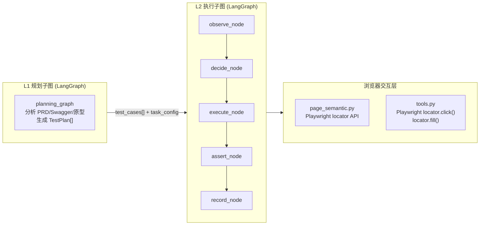

**特征**：4 层架构（规划 → 执行 → 工具 → 浏览器），每层职责清晰，但工具层和感知层都基于 Playwright 高层 API。

### browser-use v0.12.9

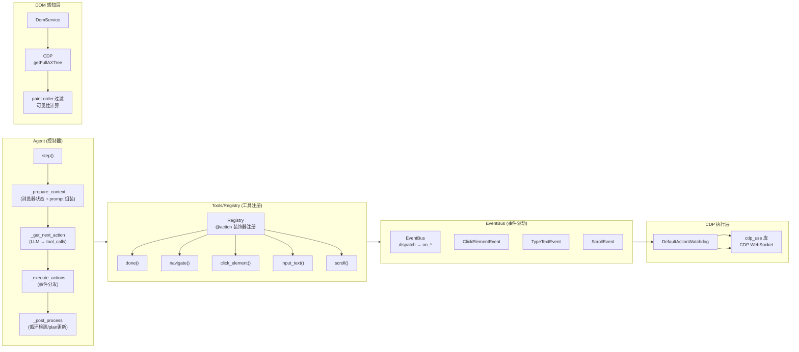

**特征**：5 层事件驱动架构，**全部基于 CDP**（无 Playwright 高层 API）。核心链路：Agent → Registry → EventBus → Watchdog → CDP。

### 关键差异 1: 架构分层粒度

| 维度 | 我们的项目 | browser-use |
|---|---|---|
| LLM → 浏览器链路 | LangGraph 节点 → 工具函数 → Playwright API → CDP | Agent → Registry → EventBus → Watchdog → CDP |
| 动作分发方式 | LangGraph `tool_call` 直接调用函数 | `Registry` 查找 → `EventBus.dispatch(event)` → `Watchdog.on_*()` |
| 是否可插拔 | 否，工具函数硬编码 | 是，Watchdog 可注册/取消注册 |
| 自定义动作 | 加 `@tool` 函数 | 加 `@registry.action()` + 可选 Watchdog handler |

---

## 2. Agent 生命周期

### 我们的项目：LangGraph 管理

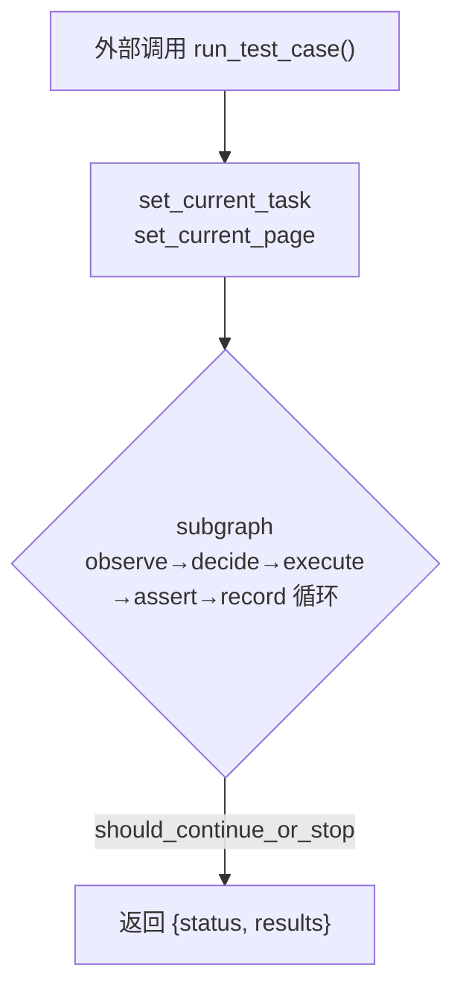

- LangGraph 的 `StateGraph` 管理全部状态迁移
- 状态是 `dict[str, Any]`，每个节点读写特定 key
- 外部（runtime.py）触发子图，等它跑完
- 循环控制：消息列表检查 + 安全阀

### browser-use: 显式 Agent 对象

```mermaid
flowchart TD
    AG["Agent(task, llm, tools, ...)"] --> START2["browser_session.start()"]
    START2 --> INIT["_execute_initial_actions()<br>（首次导航）"]
    INIT --> LOOP2{"while n_steps ≤ max_steps"}
    LOOP2 -->|step()| POST["_post_process"]
    POST -->|is_done?| DONE["log_completion()<br>_judge_and_log()"]
    POST -->|"continue"| LOOP2
    DONE --> RET2["return AgentHistoryList"]
    LOOP2 -->|"failures ≥ max"| FAIL["记录错误，break"]
    FAIL --> RET2
```

- `Agent` 自己持有循环控制、BrowserSession、MessageManager、Registry
- 状态暴露在 `self.state: AgentState` 和 `self.history: AgentHistoryList`
- 外部 `await agent.run(max_steps=100)` 等它完成
- 支持 `pause()` / `resume()` / `stop()` 控制信号

### 关键差异 2: 生命周期

| 维度 | 我们的项目 | browser-use |
|---|---|---|
| 控制主体 | LangGraph 运行时 | Agent 类自身 |
| 状态载体 | `dict` (LangGraph state) | `AgentState` (Pydantic model) |
| 外部可中断 | 否（要么跑完要么超时） | 是（`pause()`/`stop()`/`Ctrl+C`） |
| 可恢复 | 否（每用例独立子图） | 是（state 序列化后可恢复） |
| 单用例还是多用例 | 单 test_case | 单 task（可追加新 task） |

---

## 3. DOM 感知机制

### 我们的项目: `core/page_semantic.py`

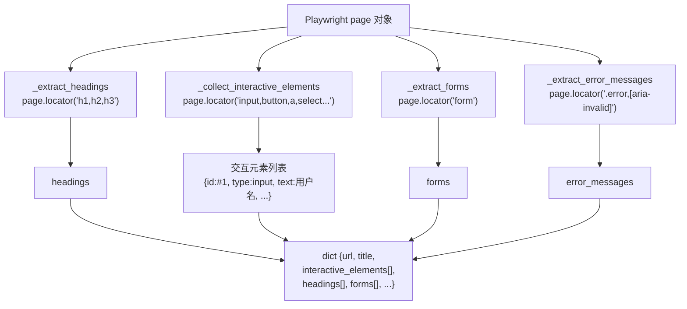

- **提取方式**：Playwright `page.locator()` CSS 选择器 + `get_by_role` / `get_by_text`
- **元素标识**：`#id1`, `#id2` ...（每次 observe 递增，不持久）
- **编号策略**：每次观察按文档顺序赋 `#idN`
- **局限性**：
  - 元素在 Shadow DOM 内可能不可达
  - 跨 iframe 元素需要手动 `frame_locator`
  - `display:none` / `visibility:hidden` 元素仍会被提取（除非显式过滤）
  - 没有 paint order 概念，元素顺序可能不反映视觉顺序
  - 元素在两次 observe 之间重建 DOM 时 `#id` 会变

### browser-use: `dom/service.py` (CDP getFullAXTree)

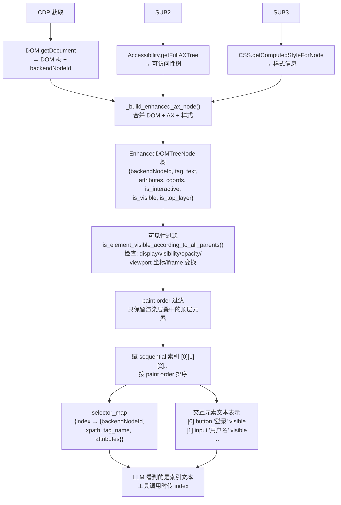

**关键优势**：
- `backendNodeId` 是 Chrome 内部的稳定节点 ID（除非节点被删除重建）
- 索引赋值按 **paint order**（渲染顺序），不是 DOM 树顺序
- 自带 visible/interactable 判断（所有父元素链的 display/visibility/opacity + viewport 裁剪）
- Shadow DOM 自动穿透（`Accessibility.getFullAXTree` 自动包含）
- iframe 递归进入（可配置 `max_iframe_depth`）

### 关键差异 3: DOM 感知

| 维度 | 我们的项目 | browser-use |
|---|---|---|
| 底层协议 | Playwright API (CDP 上层封装) | CDP 直接调用 |
| 元素发现 | CSS 选择器模式匹配 | 可访问性树 + 计算样式 |
| 索引稳定性 | 每次 observe 重建，不持久 | `backendNodeId` 持久化 |
| 排序方式 | DOM 树顺序 | Paint order（渲染顺序） |
| 可见性判断 | 无（全部返回） | 多级父链检查（display/visibility/opacity + viewport 裁剪） |
| Shadow DOM | 需手动处理 | 自动穿透 |
| iframe | 需手动 `frame_locator` | 自动递归（`max_iframes=100`） |
| 截断策略 | 硬限制 50 个元素 | 文本截断到 `max_clickable_elements_length` (40K) |

---

## 4. 动作执行机制

### 我们的项目: `agents/ui/tools.py`

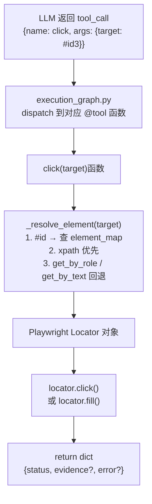

**点击实现细节**（`tools.py`）：
```python
# 使用 Playwright 的 click()
locator = page.get_by_role("button", name=text)
await locator.click()
```

**输入文本实现细节**：
```python
# 使用 Playwright 的 fill()
locator = page.get_by_label(label)
await locator.fill(text)
```

### browser-use: 事件驱动 CDP 执行

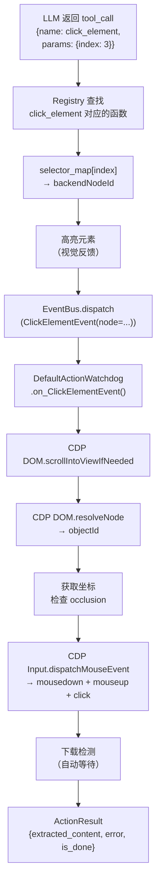

**输入文本实现细节**（`default_action_watchdog.py:1735`）：
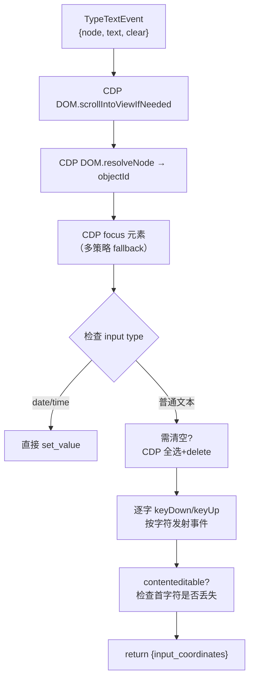

**关键行为**：
- 不是一次性 `fill()`，而是**逐字 `DispatchKeyEvent`**（`keyDown` + `keyUp`），完全模拟真人输入
- 所有触发 JS 的 `input`/`change`/`keydown`/`keyup`/`keypress` 事件
- 对 `contenteditable` 元素额外检查首字符是否被丢弃
- 对 `date`/`time` input 走直接赋值路径
- 点击有下载检测（自动等待下载开始/完成）

### 关键差异 4: 动作执行

| 维度 | 我们的项目 | browser-use |
|---|---|---|
| 点击方式 | `locator.click()` (Playwright) | `Input.dispatchMouseEvent` (CDP) |
| 输入方式 | `locator.fill()` (一次性注入) | 逐字 `DispatchKeyEvent` |
| 元素定位 | Playwright selector (text/role/label) | CDP `backendNodeId` 精准定位 |
| 下载检测 | 无 | 内置，自动等待下载 |
| 碰撞检测 (occlusion) | 无 | 有，检查元素是否被遮挡 |
| 高亮反馈 | 无 | 有（CSS 动画高亮） |
| 日期/时间输入 | 无特殊处理 | 直接 set_value |
| contenteditable | 无特殊处理 | 首字符丢失自动补偿 |

---

## 5. 提示工程

### 我们的项目: `agents/ui/prompts.py`

```python
def get_execution_system_prompt(test_case, task_config):
    return f"""<role>
你是 Web 应用测试执行智能体 (Web Test Executor)。
</role>

<context>
- 当前测试用例 ID: {test_case.id}
- 标题: {test_case.title}
- 预期结果: {test_case.expected}
- 步骤: {steps_text}
{accounts_block}
{rules_block}
{focus_block}
{scenarios_block}
{risk_block}
{memory_block}
</context>

<task>
基于当前页面状态 + 当前步骤 + 预期结果, 决定下一步
</task>

<rules>
10 条规则（标记机制、表单校验、DOM等待、单工具、自动登录、凭证安全、PRD 规则优先...）
</rules>

<examples>
1 good + 1 bad example
</examples>

<output_contract>
每次必须调一个工具，或 mark_task_*
</output_contract>"""
```

**特征**：
- XML 标签结构
- 中文编写
- 测试用例上下文（L1 信息）嵌入 `<context>`
- 大量规则约束 LLM 行为
- 步骤信息通过 `_format_page_info()` 格式化后拼接

### browser-use: `agent/prompts.py` + Markdown 模板文件

browser-use 的 system prompt 存储在 `browser_use/agent/system_prompts/` 目录的 Markdown 文件中。

```markdown
# 系统提示模板（以 thinking 模式为例）

You are a precise browser automation agent.

You can interact with web pages using these tools:
{max_actions}

## Page Structure
Interactive elements are shown between [Start of page] and [End of page].
Each element has an [index] number. Use the index to refer to elements.

## Available Actions
- click_element[index] — Click element by index
- input_text[index, "text"] — Type text into element
- scroll(direction, amount) — Scroll page
- ... (动态生成，取决于 Registry 注册了什么)

## Rules
1. Only use elements visible in the page.
2. Elements with [index] that are not clickable are for context only.
...
```

**特征**：
- Markdown 格式，无 XML
- 英文编写
- 模板选择逻辑：`_load_prompt_template()` 根据模型选择正确的模板
  - browser-use 微调模型 → 专用模板
  - Claude 4.5 → 专用模板
  - flash mode → 简化模板
  - thinking → 含推理步骤的模板
  - 无 thinking → 直接输出模板
- **只有 `{max_actions}` 一个格式化占位符**
- 动作描述来自 `Registry.get_prompt_description()`（动态生成，随注册的工具变化）

### 关键差异 5: 提示工程

| 维度 | 我们的项目 | browser-use |
|---|---|---|
| 模板语言 | 中文 | 英文 |
| 模板格式 | XML 标签 | Markdown |
| 模板数量 | 1 个（执行模板）+ 几个辅助函数 | 6+ 个 Markdown 文件（按模型/模式选） |
| 动态内容 | test_case 上下文、accounts、prd_rules、focus_areas 全部拼进系统提示 | `Registry.get_prompt_description()` 动态生成工具说明 |
| 截图放置 | `HumanMessage` 中作为 `image_url` | `AgentMessagePrompt` 中控制，vision 模式可选 |
| 推理控制 | 无 | 通过 `use_thinking` / `flash_mode` 控制 |
| 注入机制 | 字符串拼接 | `Agent._prepare_context()` 注入 loop 检测、budget 警告、replan 提示 |

---

## 6. 消息管理 / 历史压缩

### 我们的项目

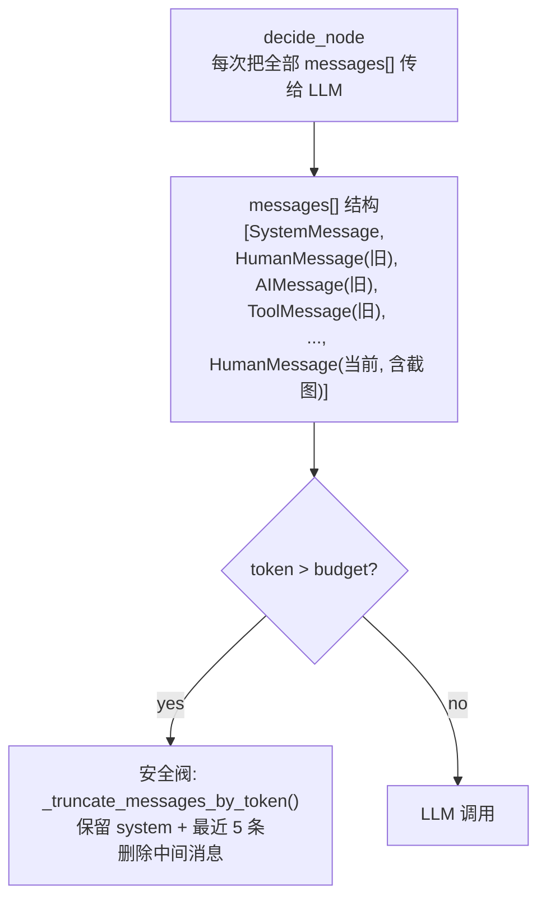

**特征**：
- LangChain `messages[]` 列表持续增长
- 超过 token budget（默认 30000）时删除中间消息
- 删除策略：保留 `[0]`（system）+ 最后 5 条，从最老往新删
- 没有**语义压缩**——删除的消息信息永久丢失
- `RemoveMessage` 是线性删除，不是摘要

### browser-use: `MessageManager`

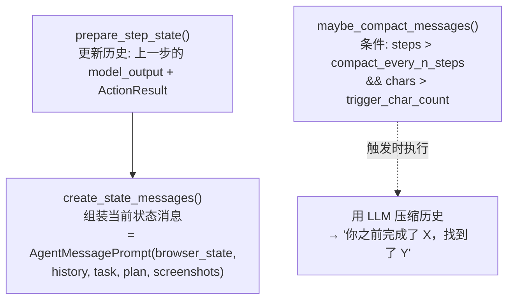

**特征**：
- `MessageManager` 是独立的 Pydantic 模型，自身有可序列化的 `MessageManagerState`
- 压缩策略：**用 LLM 做语义压缩**（不是简单删除）
  - "你之前完成了以下步骤：登录系统，导航到用户管理页面..."
  - 压缩后的内容是一个紧凑的 `SystemMessage` 或 `HumanMessage`
- 配置参数：
  - `compact_every_n_steps`：每 N 步压缩一次
  - `trigger_char_count`：超过多少字符触发
  - `keep_last_items`：保留最近几步不压缩
  - `summary_max_chars`：压缩摘要长度上限
  - `compaction_llm`：可使用不同的 LLM 做压缩（如更便宜的模型）
- 支持 `add_new_task()` — 在运行中追加新任务

### 关键差异 6: 消息管理

| 维度 | 我们的项目 | browser-use |
|---|---|---|
| 管理器 | 无独立管理器，直接操作 `messages[]` | `MessageManager` (Pydantic model) |
| 压缩方式 | 删除中间消息 | LLM 语义压缩（摘要替代） |
| 压缩触发 | token 超阈值 | 步数 + 字符数双阈值 |
| 信息保留度 | 低（删除 = 丢失） | 高（摘要 ≠ 原始，但保留语义） |
| 配置灵活度 | 固定（system + 最后 5 条） | 全部可配（步数/字符数/保留条数/摘要长度/LLM 选型） |
| 运行时追加任务 | 不支持 | 支持 `add_new_task()` |

---

## 7. 状态模型

### 我们的项目: `dict` + `interfaces.py`

```python
# 执行状态是 dict，定义在 execution_graph.py 的函数参数中
state = {
    "task_id": str,
    "test_plan": list[TestCase],
    "current_index": int,        # 当前 test_case 索引
    "current_step": int,         # 当前步数
    "consecutive_failures": int, # 连续失败
    "page_info": dict,           # 页面感知结果
    "screenshot": str,           # base64 截图
    "state_before": dict,        # 变更检测用
    "state_after": dict,
    "messages": list,            # LangChain 消息
    "session_summary": str,      # 会话摘要（跨用例）
    "task_config": dict,         # L1 输入
}

# 接口模型在 core/interfaces.py
class TestCase(BaseModel):
    id: str
    title: str
    description: str
    steps: list[str]
    expected: str
    priority: str
    category: str

class StepResult(BaseModel):
    step: int
    action: str
    result: str  # passed / failed / inconclusive
    screenshot: str
    reasoning: str

class AssertionResult(BaseModel):
    status: str      # passed / failed / inconclusive
    reasoning: str
```

### browser-use: `agent/views.py` (Pydantic 模型体系)

```python
# 核心状态
class AgentState(BaseModel):
    n_steps: int
    consecutive_failures: int
    last_result: list[ActionResult] | None
    last_model_output: AgentOutput | None
    plan: list[PlanItem] | None
    message_manager_state: MessageManagerState  # 包含完整消息历史
    loop_detector: ActionLoopDetector
    session_initialized: bool
    paused: bool
    stopped: bool

# 步骤信息
class AgentStepInfo(BaseModel):
    step_number: int
    max_steps: int

# 动作结果（每一步的返回值）
class ActionResult(BaseModel):
    is_done: bool               # 任务完成标记
    success: bool | None        # 成功/失败
    error: str | None           # 错误信息
    extracted_content: str | None  # 提取的内容
    long_term_memory: str | None   # 长期记忆
    include_in_memory: bool     # 是否进入记忆
    images: list[str]           # 结果图片
    attachments: list[str]      # 附件
    metadata: dict | None       # 元数据

# LLM 输出（结构化）
class AgentOutput(BaseModel):
    thinking: str               # 推理过程
    evaluation_previous_goal: str  # 上一步目标评估
    memory: str                 # 更新记忆
    next_goal: str              # 下一步目标
    action: list[ActionModel]   # 工具调用列表

# Plan item
class PlanItem(BaseModel):
    text: str
    status: Literal["pending", "current", "done", "skipped"]

# 配置
class AgentSettings(BaseModel):
    use_vision: bool | str
    max_failures: int
    use_thinking: bool
    flash_mode: bool
    max_actions_per_step: int
    enable_planning: bool
    loop_detection_window: int
    message_compaction: MessageCompactionSettings
    step_timeout: int
```

### 关键差异 7: 状态模型

| 维度 | 我们的项目 | browser-use |
|---|---|---|
| 形式 | `dict` + 几个 `BaseModel` | 全部 `Pydantic BaseModel` |
| LLM 输出约束 | 无结构化约束（自由文本 + tool_call） | `AgentOutput` (Pydantic) 强制结构化 |
| 动作结果 | 工具自定义格式 | `ActionResult` 标准化字段 |
| Plan 管理 | L1 的 TestPlan[]（只读） | 运行时 PlanItem[] 可动态更新（`plan_update`） |
| 序列化 | 无标准化序列化 | 全部可 JSON 序列化（支持 checkpoint） |
| 循环检测 | 无 | `ActionLoopDetector` 模型 |
| 截图存储 | `state["screenshot"]` base64 | 独立路径管理 + base64 |
| 配置聚合 | 分散在 env 变量 | `AgentSettings` 统一管理 |

---

## 8. 事件系统

### 我们的项目: 无事件系统

工具函数直接调用 Playwright API，没有中间事件层。

```
decide → 工具函数 → Playwright API → 浏览器
```

没有事件总线，没有 Watchdog，没有 hook 机制。

### browser-use: EventBus + Watchdog

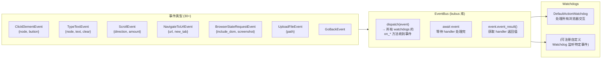

**Watchdog 注册机制**：
```python
class DefaultActionWatchdog(BaseWatchdog):
    # 按命名约定注册: on_{EventClassName}
    async def on_ClickElementEvent(self, event: ClickElementEvent) -> dict | None:
        # CDP 执行点击
        ...
    
    async def on_TypeTextEvent(self, event: TypeTextEvent) -> dict | None:
        # CDP 执行输入
        ...
```

**事件生命周期**：
```
1. 工具函数: EventBus.dispatch(ClickElementEvent(node=node))
2. EventBus: 调用所有 watchdogs 的 on_ClickElementEvent()
3. Watchdog: CDP 执行 + 下载检测
4. EventBus: handler 返回值存入 event.event_result
5. 工具函数: await event → 获取结果
```

### 关键差异 8: 事件系统

| 维度 | 我们的项目 | browser-use |
|---|---|---|
| 架构 | 工具函数直调 Playwright | 事件驱动的 CDP 管道 |
| 扩展性 | 新增工具 → 改代码 | 新增 Watchdog → 监听事件 |
| 可观测性 | 无事件层 | 事件分发可拦截、可日志 |
| 并行处理 | 无（单工具调用） | 可通过事件调度并行操作 |
| Hook 机制 | 无 | 可在执行前后插入逻辑（下载检测、occlusion 检查） |

---

## 9. 安全机制

### 我们的项目

```python
# 安全阀
MAX_STEPS_PER_CASE = int(os.getenv("MAX_STEPS_PER_CASE", "15"))
MAX_CONSECUTIVE_FAILURES = int(os.getenv("MAX_CONSECUTIVE_FAILURES", "3"))
```

- 步数上限 15
- 连续失败上限 3
- 无其他运行时安全机制

### browser-use

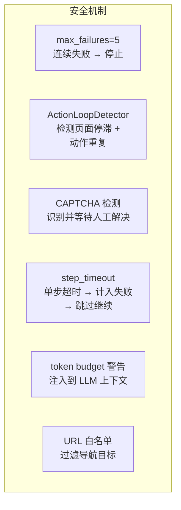

**循环检测**：
```python
class ActionLoopDetector:
    window_size: int               # 检测窗口（默认 5 步）
    recent_action_hashes: list     # 最近动作的 hash 列表
    consecutive_stagnant_pages: int  # 页面未改变次数
    max_repetition_count: int      # 最大重复次数

    def is_looping(self) -> bool:
        # 检测: 相同动作重复 → 触发 replan
```

**CAPTCHA 处理**：
```python
async def wait_if_captcha_solving(self) -> CaptchaResult | None:
    # 检测当前 URL 是否是已知 CAPTCHA 页面
    # 如果是，等待人工解决或自动解决
    # 返回等待结果（成功/失败/超时）
```

**URL 白名单**：
```python
# actions 注册时指定 domains
@self.registry.action(
    '去某个 URL',
    param_model=NavigateAction,
    domains=['*'],  # 无限制
)
```

### 关键差异 9: 安全机制

| 维度 | 我们的项目 | browser-use |
|---|---|---|
| 循环检测 | 无 | `ActionLoopDetector`（hash 比对 + 页面停滞检测） |
| CAPTCHA | 无 | 检测 + 等待人工解决 |
| 单步超时 | 无（整体 LangGraph 超时） | `step_timeout` 独立配置 |
| URL 过滤 | 无 | 域名白名单（per action） |
| Token 预算警告 | 截断但无 LLM 警告 | 注入 budget_warning 到 LLM 上下文 |
| Plan 重规划 | 无（plan 来自 L1 只读） | `replan_nudge` 注入 + `PlanItem.status` 动态更新 |

---

## 10. L1 集成 vs browser-use 的 Plan 机制

### 我们的项目: L1 → L2 单向传递

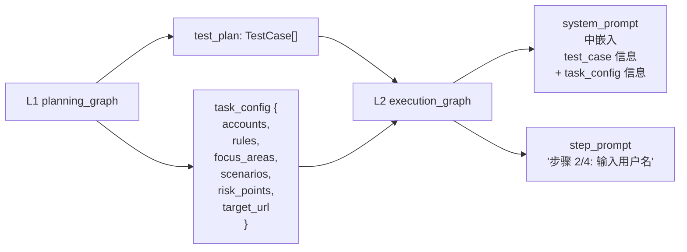

**特征**：
- L1 产出的 test_plan 和 task_config 在 L2 执行前一次性传入
- L2 的 system_prompt 包含完整的 test_case 上下文
- 但 plan 是**只读的**——L2 不能修改 plan
- L1 的 PRD 知识（字段约束、业务流程）编码在 task_config 中，LLM 被动接收
- **L1 步骤描述与 L2 observe 的元素之间没有显式锚定**——LLM 需要自己"猜"当前步骤对应哪个页面元素

### browser-use: 运行时 Plan 动态更新

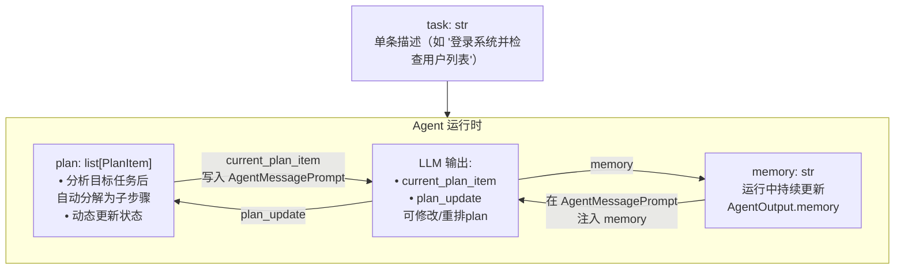

**Plan 模型**：
```python
class PlanItem(BaseModel):
    text: str                                    # 步骤描述
    status: Literal["pending", "current", "done", "skipped"]

# LLM 输出中包含 plan 控制
class AgentOutput(BaseModel):
    current_plan_item: int | None   # 当前执行到第几步（索引）
    plan_update: list[str] | None   # 更新整个 plan 列表
```

**特征**：
- Plan 不是外部传入的，而是 Agent 内部自动生成的（通过 LLM 分析 task）
- LLM 每步可以更新 plan（`plan_update`），实现**动态重规划**
- `AgentOutput.memory` 是运行中持续更新的自由文本记忆（类似 scratchpad）
- Plan + Memory 一起注入到每步的 `AgentMessagePrompt` 中

### 关键差异 10: Plan 机制

| 维度 | 我们的项目 | browser-use |
|---|---|---|
| Plan 来源 | L1 planning_graph（外部） | LLM 自动分析 task 生成（内部） |
| Plan 可变性 | 只读（L2 不能改） | 动态更新（LLM 可修改 `plan_update`） |
| 步骤粒度 | test_case.steps[]（细化但不更新） | PlanItem[]（可重排/跳过/添加） |
| Memory | `session_summary` 跨用例 | `AgentOutput.memory` 持续更新 |
| L1 输入利用 | system_prompt 嵌入全部信息 | 无对应（browser-use 没有 L1） |
| 步骤-元素锚定 | 无（LLM 自己猜） | 无（但 single task 设计不需要） |

---

## 11. 性能维度

### 截图的差异

| 维度 | 我们的项目 | browser-use |
|---|---|---|
| 截图格式 | JPEG q=60 | PNG 或 JPEG（可配置） |
| 截图触发 | 每次 observe | 每次 `_prepare_context`（= 每步） |
| 截图大小控制 | `take_screenshot_compressed()` | `llm_screenshot_size` 可缩放 |
| Vision 模式 | 总是传截图 | `use_vision` 可关闭（仅文本） |
| 截图编码 | base64 → `image_url` | base64 → `image_url` |

### 每步调用数

| 阶段 | 我们的项目 | browser-use |
|---|---|---|
| LLM 调用/步 | **2 次**（decide + assert） | **1 次**（_get_next_action） |
| DOM 提取/步 | 1 次（observe） | 1 次（_prepare_context） |
| 截图/步 | 1 次（observe） | 1 次（get_browser_state_summary） |
| 工具调用/步 | 1 次（单 tool_call） | 1~N 次（可多 action 并行） |

### Token 消耗

| 维度 | 我们的项目 | browser-use |
|---|---|---|
| 每次 LLM 调用的消息数 | 增长型（history 累积） | 增长型但有压缩 |
| 截图 token | JPEG base64 | PNG 或缩放后 base64 |
| 元素描述 | 自定义格式 | `[index] tag text visible` 紧凑格式 |
| System prompt 大小 | 大（含 L1 所有上下文） | 适中（Markdown 模板 + 工具描述） |

### 关键差异 11: 性能

| 维度 | 我们的项目 | browser-use |
|---|---|---|
| 每步 LLM 调用 | 2 次（decide + 独立的 assert） | 1 次（action 中隐含完成判断） |
| 并行动作 | 不支持（1 tool_call/步） | 支持（action: list[ActionModel]） |
| 压缩方式 | 删除旧消息（信息丢失） | LLM 语义压缩（信息保留） |

---

## 12. 可观测性

### 我们的项目

- `execution_logger.py`: `log_node_event()` 记录节点生命周期
- `_last_node_name` / `_last_node_duration_ms` 写入 state
- WebSocket 通过 runtime 发送节点事件
- 没有结构化追踪、没有 token 消耗统计（除了 `count_tokens`）

### browser-use

- `@observe` / `@observe_debug` 装饰器：追踪关键调用
- `@time_execution_async` 装饰器：记录耗时
- `TokenCostService`：完整 token 消耗统计（输入/输出/缓存/总成本）
- `History`：完整的 `AgentHistoryList`，包含每步的 `model_output`、`state`、`result`、`metadata`
- `UsageSummary`：按模型的 token 统计
- Telemetry：`_log_agent_event()` / `_log_agent_run()`
- SignalHandler：支持 Ctrl+C 优雅退出 + 日志

### 关键差异 12: 可观测性

| 维度 | 我们的项目 | browser-use |
|---|---|---|
| Token 统计 | 仅 `count_tokens()` 估算 | `TokenCostService` 精确统计 |
| 历史记录 | `messages[]`（含完整对话） | `AgentHistoryList`（结构化每步状态） |
| 执行耗时 | `_last_node_duration_ms` | `@time_execution_async` 装饰关键方法 |
| 信号处理 | 无 | Ctrl+C pause/resume/stop |

---

## 总结：如果想达到 browser-use 的效果，需要改造的模块

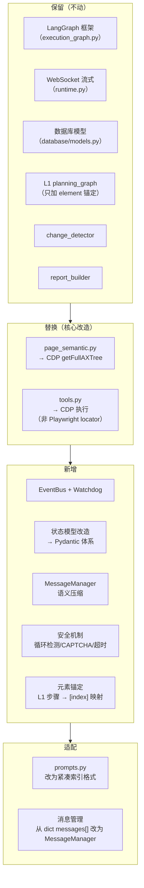

**改造后效果**：
- DOM 感知 → 准（paint order + backendNodeId + 可见性过滤）
- 动作执行 → 稳（CDP 直接调用 + 事件保障）
- 元素引用 → 持久（索引 → backendNodeId 跨刷新锚定）
- LLM 调用 → 少（合并 assert 到 action result）
- 历史管理 → 聪明（语义压缩不丢信息）
- 安全机制 → 全（循环检测 + CAPTCHA + 超时）
- L1 集成 → 实用（步骤锚定到元素索引）
