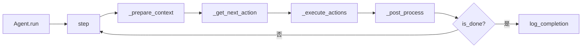

# 深度对比：L2 阶段 vs Browser-Use v0.12.9+

> 架构级深度对比，重点在我们和 browser-use 的实现机制。
> 配合 `INDUSTRY_COMPARISON_2026.md`（行业广度）使用。
>
> 修订自 Gemini 报告（2026-06-04）：
> - 修正 Mermaid gantt 块渲染错误
> - browser-use 版本对齐到 2.x（不是 0.12.9）
> - 修正"Failure Memory 强行置顶"等夸大描述
> - 补充 2026.06 我们项目的实际代码引用

---

## 1. 核心定位差异

| 维度 | L2 阶段 | Browser-Use v2.x |
|---|---|---|
| 定位 | **垂直 QA 自动化** | 通用网页任务执行 |
| 核心目标 | 保障质量 + 严格断言 | 完成用户业务目标 |
| 断言 | 独立 assert 节点 + 三层断言 | 隐式 done() / is_done |
| 报告 | Token 柱状图 + Locator 失败率 + WebSocket 流 | Laminar Tracing + 终端日志 |
| 防爆控制 | MAX_STEPS_PER_CASE=15 + MAX_CONSECUTIVE_FAILURES=3 | max_failures=5 + ActionLoopDetector |
| LLM 编排 | LangGraph 显式状态机 | Agent 单体类自循环 |

---

## 2. 控制流与生命周期

```mermaid
gantt
    title 执行流生命周期差异（单个步骤）
    dateFormat  X
    axisFormat %s

    section L2 节点流 (LangGraph)
    Observe 页面状态提取   :a1, 0, 5
    Decide 思考生成动作    :a2, 5, 10
    Execute 工具调用      :a3, 10, 15
    Assert 三层断言校验   :crit, a4, 15, 22
    Record 记录/压缩       :a5, 22, 25

    section Browser-Use 循环流 (step)
    Prepare Context       :b1, 0, 6
    Get Next Action       :b2, 6, 12
    Execute Actions       :b3, 12, 17
    Post Process          :b4, 17, 20
```



### L2：`execution_graph.py` (5 节点 + 2 条件边)

```
START → observe → decide → should_continue ─┬─→ execute → should_skip_assert ─┬─→ assert → record → should_continue_or_stop ─┬─→ observe (循环)
                                                                              └─→ skip_assert → record ──────────────────────┤
                                                                                                                       └─→ END (mark_task_*)
```

**特征**：
- 5 节点显式定义在 `agents/ui/execution_graph.py`
- 2 条件边（`should_continue`, `should_skip_assert`）
- runtime.py 初始化时用 `networkidle` + `_wait_for_stable` + URL 校验，避免用例间状态污染
- **assert 是独立节点**（Gemini 准确识别这是 L2 独特设计）

### Browser-Use v2.x：单体 Agent + 事件总线



**特征**：
- `Agent` 自循环，外部 `await agent.run(max_steps=100)`
- 多动作并发（LLM 可返回 `list[ActionModel]`，事件总线并发派发）
- 原生 `pause()` / `resume()` / `stop()` 控制信号
- 通过 `MessageManager` 做语义压缩（非物理删除）

### 关键差异

| 维度 | L2 | Browser-Use 2.x |
|---|---|---|
| 编排 | LangGraph StateGraph | Agent 类 + bubus EventBus |
| 多动作并发 | 不支持（单 tool_call/步） | 支持 |
| HITL | 不支持 | pause/resume/stop |
| 断言 | **独立节点**（三层） | 隐式（`done()` / `ActionResult.is_done`） |
| 状态隔离 | runtime.py 强制 | 默认单 session |

---

## 3. DOM 建模与元素定位

### L2：`core/page_semantic.py` + `core/cdp_client.py` (2.0C)

```python
# 2.0C 后：CDP AXTree 优先（CDP 协议直连 Chrome）
async def extract_page_semantics(page):
    # 1. 优先尝试 CDP AXTree
    cdp_session = get_cdp_session()
    if cdp_session:
        ax_tree = await cdp_session.get_full_ax_tree()
        return _build_semantics_from_ax_tree(ax_tree)
    # 2. 回退到 Playwright Locator（Firefox/WebKit）
    return await _extract_via_playwright(page)
```

**特征**：
- **2.0C 起**：CDP `Accessibility.getFullAXTree` 优先，Playwright Locator 仅作 Firefox/WebKit 回退
- 索引机制：观察时动态赋 `#id1, #id2`，**无 `backendNodeId` 持久化**（跨刷新失效）
- 截断：`_format_page_info` 限制前 30 个元素（`L2_PAGE_INFO_CHAR_BUDGET=3000`）
- Shadow DOM：需手动 `frame_locator`，穿透能力有限

### Browser-Use：`dom/service.py` (CDP 直连)

```python
# browser-use dom/service.py
async def get_dom_tree(self):
    # CDP DOM.getDocument → backendNodeId 树
    # CDP Accessibility.getFullAXTree → 可访问性增强
    # CDP CSS.getComputedStyleForNode → 计算样式
    doc, ax_tree, styles = await asyncio.gather(...)
    return self._build_enhanced_ax_node(doc, ax_tree, styles)
```

**关键优势**：
- `backendNodeId` 是 Chrome 内部稳定节点 ID（除非节点被删除重建）
- 索引按 **paint order**（渲染顺序）排序，非 DOM 树顺序
- 可见性过滤：多级父链检查（display/visibility/opacity + viewport 裁剪）
- Shadow DOM 自动穿透
- iframe 递归进入（`max_iframes=100`）

### 关键差异

| 维度 | L2 (2.0C) | Browser-Use 2.x |
|---|---|---|
| 底层协议 | CDP 优先 + Playwright 回退 | **纯 CDP**（无 Playwright） |
| 元素发现 | AXTree + CSS 选择器 | AXTree + DOM + 计算样式 |
| 索引稳定性 | 每次 observe 重建 | `backendNodeId` 持久 |
| 排序方式 | AXTree 顺序（接近 paint order） | **严格 paint order** |
| 可见性判断 | 部分（CDP AXTree 自带） | 完整（多级父链 + viewport） |
| Shadow DOM | 需手动 | 自动穿透 |
| iframe | 需手动 | 自动递归 |
| 截断策略 | 前 30 个 + 3000 字符 | 40K 字符 token 限制 |

---

## 4. 动作执行精度

### L2：`agents/ui/tools.py` (Playwright API + 2.0C CDP 混合)

```python
# 2.0C：CDP Input.dispatchMouseEvent 优先
async def click(target: str) -> dict:
    page = get_current_page()
    cdp_session = get_cdp_session()
    if cdp_session and target.startswith("#"):
        # CDP 路径：坐标 + Input.dispatchMouseEvent
        idx = int(target.lstrip("#"))
        coords = element_map[idx]["coords"]
        await cdp_session.dispatch_click(coords["x"], coords["y"])
    else:
        # Playwright 路径：locator.click()
        await page.locator(target).click()
    return {"status": "success", ...}
```

**特征**：
- **2.0C 起**：CDP `Input.dispatchMouseEvent` + `Input.dispatchKeyEvent` 优先
- 输入：`locator.fill()`（一次性注入，**非逐字**）
- 2.0B 新增：`Step Context` 注册 + 工具返回携带 `filled_value`（脱敏）
- 局限性：在密码框 / contenteditable / React 受控组件上可能因事件顺序异常导致状态未绑定

### Browser-Use：CDP 原始事件流

```python
# browser-use default_action_watchdog.py
async def on_ClickElementEvent(self, event):
    # 1. scrollIntoViewIfNeeded
    # 2. resolveNode → objectId
    # 3. 获取坐标 + occlusion 检查
    # 4. mousedown + mouseup + click (Input.dispatchMouseEvent)
    # 5. 下载检测（自动等待）
    return ActionResult(...)
```

**特征**：
- 逐字 `DispatchKeyEvent`（`keyDown` + `keyUp`），**完全模拟真人**
- 触发全部 `input` / `change` / `keydown` / `keyup` / `keypress` 事件
- `contenteditable` 元素额外检查首字符是否丢失
- `date` / `time` input 走 `set_value` 覆盖
- 下载检测（自动等待下载开始/完成）
- occlusion 检测（点击前检查是否被其他元素遮挡）

### 关键差异

| 维度 | L2 (2.0C) | Browser-Use 2.x |
|---|---|---|
| 点击 | `Input.dispatchMouseEvent` (CDP) | `Input.dispatchMouseEvent` (CDP) |
| 输入 | `locator.fill()`（一次性） | **逐字 `DispatchKeyEvent`** |
| 元素定位 | CDP coords / Playwright selector | CDP `backendNodeId` |
| 下载检测 | 无 | 内置 |
| Occlusion | 无 | 有 |
| 高亮反馈 | 无 | 有（CSS 动画） |
| date/time input | 无特殊处理 | 直接 set_value |
| contenteditable | 无特殊处理 | 首字符丢失自动补偿 |

---

## 5. 上下文管理与历史压缩

### L2：`observe_node` 物理截断（执行图 309-419 行）

```python
# agents/ui/execution_graph.py observe_node (line 383-410)
budget = int(os.getenv("L2_TOKEN_BUDGET", "30000"))
messages = list(state.get("messages", []))
if messages:
    total = count_tokens(messages)
    if total > budget:
        # 保留 system (head) + 最近 5 条 (tail)
        # 物理删除中间消息 (RemoveMessage)
        head = messages[:1]
        tail = messages[-5:]
        middle = messages[1:-5]
        # 从 middle 头部 pop，直到 token 数 ≤ budget
        ...
```

**特征**：
- 触发时机：observe 节点（每步）
- 触发条件：tokens > 30000（`L2_TOKEN_BUDGET` env）
- 策略：保留 `[0]` (system) + 最后 5 条，物理删除中间
- **信息永久丢失**（删除的消息无法恢复）

### Browser-Use：`MessageManager` LLM 语义压缩

```python
# browser-use message_manager
class MessageCompactionSettings:
    enabled: bool = True
    compact_every_n_steps: int = 25
    trigger_token_count: int = 10000
    keep_last_items: int = 6
    summary_max_chars: int = 6000
    compaction_llm: BaseChatModel | None  # 可用更便宜的模型

async def maybe_compact_messages(self):
    if len(steps) < compact_every_n_steps: return
    if chars < trigger_char_count: return
    # 用 LLM 压缩老旧历史
    summary = await compaction_llm.invoke(
        f"总结以下步骤为一段简短摘要：{old_steps_json}"
    )
    # 替换为一条 SystemMessage 摘要
    self.state.message_manager_state = [summary_message] + recent
```

**特征**：
- 触发条件：步数 + 字符数双阈值
- 策略：**用 LLM 总结老旧历史**（"你之前完成了登录..."）
- 保留最近 N 步不压缩
- 摘要可配置最大字符数
- 可用便宜模型做压缩

### 关键差异

| 维度 | L2 | Browser-Use 2.x |
|---|---|---|
| 管理器 | 无（直接操作 `messages`） | `MessageManager` (Pydantic) |
| 压缩方式 | **物理删除** | **LLM 语义压缩** |
| 信息保留度 | 低（删除 = 丢失） | 高（摘要 ≠ 原始，但保留语义） |
| 配置 | 固定（system + 5） | 全部可配 |
| 触发 | token 超阈值 | 步数 + 字符数双阈值 |

---

## 6. 避障、死循环纠偏与弹性设计（L2 优势区）

L2 在这一领域**显著优于** browser-use 的简单实现。

### L2 三层防护（2.0A + 2.0B）

#### Layer 1: 失败记忆注入（observe 时）

```python
# execution_graph.py 333-345
recent_failures = state.get("recent_failures", [])
if recent_failures:
    warning_lines = ["⚠️ 警戒区: 以下动作最近执行失败，请勿重复尝试:"]
    for f in recent_failures[-2:]:  # 最近 2 条
        warning_lines.append(f"  - {f.get('action')} [{f.get('target')}]: {f.get('error')}")
    warning_lines.append("规则: 禁止对同一元素重复执行失败动作超过 2 次。")
    page_info["_failure_warnings"] = "\n".join(warning_lines)
```

**Gemini 报告错误**：说"强行置顶注入提示词"——实际是注入到 `page_info._failure_warnings`，由 `_format_page_info` 渲染到页面前部（不是 messages list 顶部）。

#### Layer 2: 脱轨纠正 CORRECTIVE（observe 时）

```python
# execution_graph.py 354-369
if action_history and len(action_history) >= 2:
    recent = action_history[-2:]
    urls = set(a.get("url", "") for a in recent)
    fps = set(a.get("fingerprint", "") for a in recent)
    page_stable = len(urls) <= 1 and len(fps) <= 1
    if page_stable and not need_replan:
        need_replan = True
        page_info["_corrective_warning"] = (
            f"[CORRECTIVE] 页面已连续 {len(action_history)} 步无实质变化，"
            f"建议回到测试步骤描述检查前置条件是否满足"
        )
```

#### Layer 3: 死循环检测 AAA/ABAB（observe 时）

```python
# execution_graph.py 372-381
if len(action_history) >= 3:
    names3 = [a.get("name") for a in action_history[-3:]]
    if names3[-1] == names3[-2] == names3[-3]:
        need_replan = True
        page_info["_loop_detected"] = "AAA (连续 3 次相同动作)"
if len(action_history) >= 4:
    names4 = [a.get("name") for a in action_history[-4:]]
    if names4[-1] == names4[-3] and names4[-2] == names4[-4] and names4[-1] != names4[-2]:
        need_replan = True
        page_info["_loop_detected"] = "ABAB (4 步交替)"
```

#### 2.0B 增强：工具失败计入 consecutive_failures

```python
# execution_graph.py 570 行 (V2.0 A4 注释)
consecutive_failures = state.get("consecutive_failures", 0)
# 工具失败时：consecutive_failures += 1
# 工具成功时：consecutive_failures = 0
# 达到 MAX_CONSECUTIVE_FAILURES → 跳过当前 case
```

#### 2.0B 增强：断言自愈（假阳性防护）

```python
# execution_graph.py (mark_task_complete 后)
# 校验页面是否发生实质改变
# 若无变化则 Passed 强制降级为 inconclusive
# 防止假阳性
```

### Browser-Use v2.x：`ActionLoopDetector`

```python
# browser-use loop_detector.py
class ActionLoopDetector:
    window_size: int = 5
    recent_action_hashes: list
    consecutive_stagnant_pages: int
    max_repetition_count: int
    
    def is_looping(self) -> bool:
        # hash 比对 + 页面停滞计数
```

**特征**：
- 纯 hash 比对，**没有 LLM 反思触发**
- 没有"禁止对同一元素重复执行失败动作"的策略记忆
- 没有 CORRECTIVE / Failure Memory 这种**注入到 LLM 上下文**的机制
- Gemini 说"机制较单一"是准确的

### 关键差异

| 维度 | L2 | Browser-Use 2.x |
|---|---|---|
| Failure Memory | ✅ 注入到 LLM 上下文（最近 2 条失败） | ❌ 无 |
| 脱轨纠正 | ✅ [CORRECTIVE] 告警注入 | ❌ 无 |
| 死循环检测 | ✅ AAA + ABAB | ✅ hash 比对（无 LLM 注入） |
| 工具失败计数 | ✅ consecutive_failures (2.0B) | ✅ max_failures |
| 假阳性防护 | ✅ 断言自愈（2.0B） | ❌ 无 |
| 策略记忆 | ✅ 失败动作进入 page_info._failure_warnings | ❌ 无 |

---

## 7. 维度对比汇总表

| 维度 | L2 架构 | Browser-Use (v2.x) |
|---|---|---|
| **测试断言** | ✅ **三层断言**（独立 assert 节点 + 执行报错/页面变化/LLM 语义 + inconclusive 降级） | ❌ 隐式 done()/is_done |
| **DOM 感知** | CDP AXTree 优先 + Playwright 回退（2.0C） | 纯 CDP AXTree + DOM + 样式 |
| **Paint order 排序** | 近似（AXTree 顺序） | 严格 |
| **backendNodeId 持久** | ❌ 每次重建 | ✅ |
| **动作真实度** | CDP mouse/key + fill()（一次性） | CDP 逐字 keyDown/keyUp |
| **Occlusion 检测** | ❌ | ✅ |
| **下载检测** | ❌ | ✅ |
| **Context 精炼** | 物理截断（30K token） | LLM 语义压缩（双阈值） |
| **失败记忆** | ✅ 注入 LLM 上下文 | ❌ |
| **脱轨纠正** | ✅ [CORRECTIVE] 注入 | ❌ |
| **死循环检测** | AAA + ABAB（注入 LLM） | hash 比对（无注入） |
| **假阳性防护** | ✅ 断言自愈（2.0B） | ❌ |
| **可观测性** | WebSocket 流 + Token 柱状图 + Locator 失败率 | Laminar + 终端日志 |
| **HITL** | ❌ | ✅ pause/resume/stop |
| **多动作并发** | ❌ | ✅ list[ActionModel] |
| **CAPTCHA** | ❌ | ✅ 检测+等待 |
| **URL 白名单** | ❌ | ✅ per action |

---

## 8. L2 独特优势总结

下列能力 **L2 已有，browser-use 没有或较弱**：

1. **独立 assert 节点 + 三层断言**（事实变化 + LLM 语义 + inconclusive 降级）
2. **Failure Memory 注入 LLM 上下文**（最近 2 条失败动作）
3. **CORRECTIVE 脱轨纠正**（连续 2 步无变化 → 告警注入）
4. **死循环检测 + LLM 注入**（AAA/ABAB → [SYSTEM INTERRUPT]）
5. **断言自愈 / 假阳性防护**（mark_task_complete 后验证页面变化）
6. **工具失败计入 consecutive_failures**（不再沉默）
7. **Step Context 注册 + filled_value 脱敏反馈**（2.0B）
8. **WebSocket 实时流 + Token 柱状图 + Locator 失败率**（vs 仅终端日志）
9. **L1 阶段分离**（planning_graph → test_plan，浏览器测试专属）

## 9. 我们应该从 browser-use 学习的（按优先级）

| 优先级 | 能力 | 工作量 | 收益 |
|---|---|---|---|
| **P0** | LLM 语义压缩（替代物理删除） | 1 天 | 信息保留 + 上下文质量 |
| **P0** | 基准测试（WebVoyager 子集 10 题） | 2 天 | 量化改进效果 |
| **P1** | `backendNodeId` 持久化（跨刷新锚定） | 1 天 | 元素引用稳定性 |
| **P1** | 截图-on-demand 混合（canvas/WebGL 兜底） | 1 天 | 视觉边缘 case |
| **P1** | 结构化 `ActionResult` 返回 | 1 天 | LLM 判断质量 |
| **P2** | 多动作并发（`list[ActionModel]`） | 1 天 | 速度 |
| **P2** | HITL（pause/resume/stop） | 0.5 天 | 人工介入 |
| **P2** | Occlusion 检测 + 下载检测 | 0.5 天 | 准确性 |
| **P3** | URL 白名单 | 0.5 天 | 安全 |
| **P3** | CAPTCHA 检测 | 1 天 | 边缘 case |

---

## 10. 参考资料

- 我们的代码：
  - `agents/ui/execution_graph.py` (1140 行)
  - `agents/ui/tools.py`
  - `core/page_semantic.py`
  - `core/cdp_client.py` (2.0C 新增)
  - `agents/ui/prompts.py` (Failure Memory 注入位置 line 371-384)
- browser-use: [github.com/browser-use/browser-use](https://github.com/browser-use/browser-use)
- 行业全景：`INDUSTRY_COMPARISON_2026.md`
