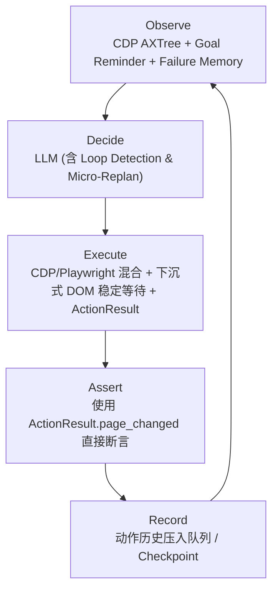

# Phase 2.0A: CDP 迁移与 L2 执行层重构

> Tech Lead 最终批准版

## 改造背景

原计划在 Playwright 机制上"打补丁"（ActionResult 标准化、DOM 语义增强等），经源码级对比 browser-use v0.12.9 后，发现根因问题不在"少打了什么补丁"，而在**底层技术选型**：

| 问题现象 | 根因 | 解决路径 |
|---|---|---|
| 元素定位漂移 | Playwright `get_by_*` 文本匹配不稳定 | CDP `getFullAXTree` + `backendNodeId` 锚定 |
| 事件触发不完整 | `locator.fill()` 一次性注入，JS 校验跳不过 | CDP 逐字 `DispatchKeyEvent` / `press_sequentially()` |
| 动作结果不可知 | 工具返回裸文本，无结构化证据 | `ActionResult` 统一模型 + DOM 指纹比对 |

## 改造后架构



**关键设计决策**：
- 不增加 LangGraph 节点（ObserveAfterAction 下沉到工具内部）
- 感知层全部 CDP，执行层 CDP click + Playwright `press_sequentially` 混合
- Assert 直接读 `ActionResult.page_changed`，不再独立做 change_detector

---

## Sprint 1: CDP 感知层、复合定位锚定与 Prompt 格式适配 (P0)

**工期**：2.5 天  
**目标**：根除 Playwright Locator 漂移，通过 CDP `getFullAXTree` 获取准确的交互元素。

### 改造范围

**`core/page_semantic.py`** — 整体替换

| 现状 (Playwright) | 目标 (CDP) |
|---|---|
| `page.locator('input,a,button...')` CSS 匹配 | CDP `Accessibility.getFullAXTree` + `DOM.getDocument` |
| `get_by_role` / `get_by_text` 文本解析 | `EnhancedDOMTreeNode` 合并 DOM + AX + computed style |
| 每次重建 `#id1,#id2...` | 赋 `[0][1][2]...` 索引，`selector_map: index → {backendNodeId, xpath}` |
| 元素按 DOM 序排列 | 按 paint order（渲染顺序）排列 |
| 无 visible/enabled/readonly 判断 | 递归检查父链 + computed style |
| Shadow DOM 不可达 | CDP AXTree 自动穿透 |

### 元素引用锚定策略

> `backendNodeId` 在页面**导航/强刷**后会重置。采用 `{page_url + backendNodeId}` 复合 key 锚定。

```python
element_map = {
    "{page_url}::{backendNodeId}": {
        "index": 0,
        "tag": "input",
        "text": "用户名",
        "state": { "visible": true, "enabled": true, "readonly": false },
        "coords": { "x": 100, "y": 200, "w": 300, "h": 40 },
        "xpath": "//input[@id='username']"
    }
}
```

### Prompt 格式适配

**`agents/ui/prompts.py`** — `_format_page_info()` 输出切换：

```
当前页面元素:
  [0] input "用户名" (visible=true, enabled=true, required=true)
  [1] input "密码" (visible=true, enabled=true)
  [2] button "登录" (visible=true, enabled=false)
  [3] a "忘记密码" (visible=true)
```

---

## Sprint 2: 混合动作执行层与 ActionResult 精简断言 (P0)

**工期**：1 天  
**目标**：合并高/低级 API 交互，消除断言冗余。

### 混合动作执行

`agents/ui/tools.py` 改造：

| 工具 | 原实现 | 新实现 |
|---|---|---|
| `click(index)` | `locator.click()` (Playwright) | CDP `Input.dispatchMouseEvent`，回退 Playwright 物理坐标 click |
| `input_text(index, text)` | `locator.fill(text)` | `press_sequentially()` 逐字输入 + 完整 keydown/keyup |
| `scroll(direction)` | `page.evaluate()` | 保持不变 |

### ActionResult 统一

```python
class ActionResult(BaseModel):
    status: str          # "success" | "failure"
    page_changed: bool   # 通过 DOM 指纹比对
    url_before: str
    url_after: str
    dom_fingerprint_before: str
    dom_fingerprint_after: str
    error: str | None
    extracted_content: str | None
```

### Assert 优化

`assert_node` 直接读 `ActionResult.page_changed` 作为断言依据，不再单独调用 `change_detector.py`。

---

## Sprint 3: 工具级等待下沉与 Goal Reminder (P0)

**工期**：1 天  
**目标**：下沉稳定化等待，Goal Reminder 锁死 Agent 专注度。

### 等待机制

在 `tools.py` 内部动作尾部，不增加 LangGraph 节点。

```python
async def wait_for_stable(page, timeout=5000, poll_interval=250):
    # 网络静默兜底: networkidle 永不静默时不阻塞
    try:
        await page.wait_for_load_state("networkidle", timeout=2000)
    except:
        pass

    # 核心: DOM Stable 轮询
    for _ in range(timeout // poll_interval):
        before = _get_dom_fingerprint(page)
        await asyncio.sleep(poll_interval / 1000)
        after = _get_dom_fingerprint(page)
        if before == after:
            await asyncio.sleep(0.5)  # 物理动画缓冲
            return True
    return True  # 超时不抛异常
```

### Goal Reminder (P0)

**`execution_graph.py`** — `decide_node`：

```python
goal_reminder = f"""════════════════════════════════════════════════════
🧭 CURRENT TEST GOAL
   用例ID: {test_case.id}
   标题: {test_case.title}
   描述: {test_case.description}
   当前步骤: {current_step}/{total_steps}
✅ SUCCESS CRITERIA: {test_case.expected}
════════════════════════════════════════════════════"""

human_content = f"{goal_reminder}\n\n{step_prompt}\n\n当前页面状态:\n{page_summary}"
```

---

## Sprint 4: Failure Memory 失败动作记忆 (P1)

**工期**：0.5 天  
**目标**：拦截动作级报错，阻止 LLM 在同一个卡点死撞。

- `TestState` 新增 `recent_failures: list[dict]`（滑动队列，max=3）
- 工具失败时追加，成功时清空
- Observe 注入最近 2 条失败警告 + 约束规则

---

## Sprint 5: Loop Detection 与 Micro-Replan (P2)

**工期**：0.5 天  
**目标**：检测 AAA/ABAB 复合循环，执行微观重规划。

### ABAB 判局精确化

- 只记录动作**一级分类**（click/input_text/scroll），不计入参数
- 命中条件：一级分类交替 + 页面指纹从未变 + URL 未变
- 自动排除"输入 A → 点击 B"正常交替

### Micro-Replan

命中后标记 `need_replan=True`，注入 `[SYSTEM INTERRUPT]`：
- 不清除已完成步骤
- 在当前步骤做微观路径修正（Tab 换路 / 检查弹窗 / mark_failed）

---

## 工期汇总

| Sprint | 内容 | 工期 | 优先级 |
|---|---|---|---|
| 1 | CDP 感知层 + 复合锚定 + Prompt 适配 | 2.5 天 | P0 |
| 2 | 混合执行 + ActionResult + Assert 精简 | 1 天 | P0 |
| 3 | 等待下沉 + Goal Reminder | 1 天 | P0 |
| 4 | Failure Memory | 0.5 天 | P1 |
| 5 | Loop Detection + Micro-Replan | 0.5 天 | P2 |
| **合计** | | **3.5~5.5 天** | |

---

## 执行顺序建议

1. **Sprint 3（Goal Reminder）** — 不依赖任何改造，现在可独立 PR（0.5 天）
2. **Sprint 1（CDP 感知）** — 最核心，先啃
3. **Sprint 2 + 3 剩余（等待下沉）** — 依赖 Sprint 1
4. **Sprint 4（Failure Memory）** — 独立
5. **Sprint 5（Loop Detection）** — 依赖 Sprint 4 的 action_history
